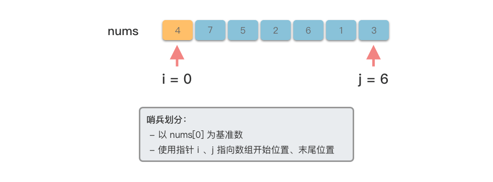
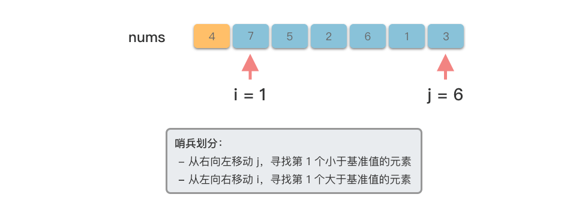
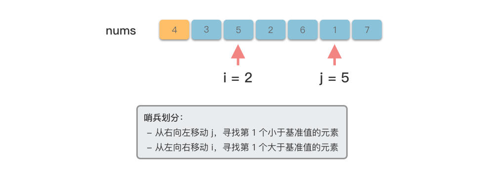
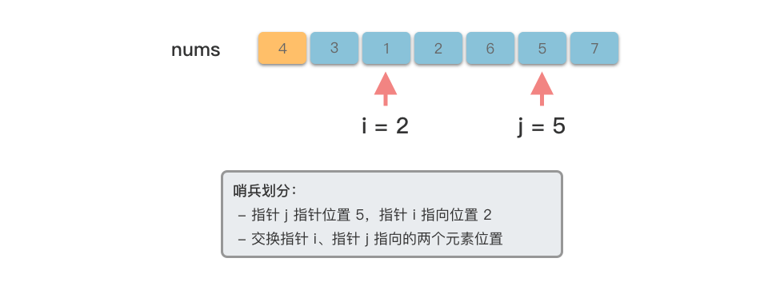
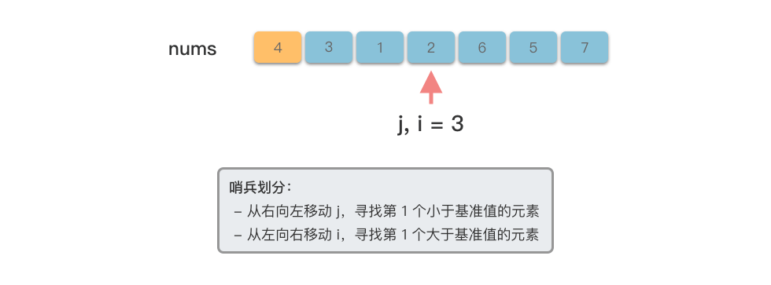

# 01.03.08 快速排序（第 07 天）

## 1. 快速排序算法思想

> **快速排序（Quick Sort）基本思想**：
>
> 采用经典的分治策略，选择数组中某个元素作为基准数，通过一趟排序将数组分为独立的两个子数组，一个子数组中所有元素值都比基准数小，另一个子数组中所有元素值都比基准数大。然后再按照同样的方式递归的对两个子数组分别进行快速排序，以达到整个数组有序。
>

## 2. 快速排序算法步骤

假设数组的元素个数为 $n$ 个，则快速排序的算法步骤如下：

1. **哨兵划分**：选取一个基准数，将数组中比基准数大的元素移动到基准数右侧，比他小的元素移动到基准数左侧。
   1. 从当前数组中找到一个基准数 $pivot$（这里以当前数组第 $1$ 个元素作为基准数，即 $pivot = nums[low]$）。
   2. 使用指针 $i$ 指向数组开始位置，指针 $j$  指向数组末尾位置。
   3. 从右向左移动指针 $j$，找到第 $1$ 个小于基准值的元素。
   4. 从左向右移动指针 $i$，找到第 $1$ 个大于基准数的元素。
   5. 交换指针 $i$、指针 $j$ 指向的两个元素位置。
   6. 重复第 $3 \sim 5$ 步，直到指针 $i$ 和指针 $j$ 相遇时停止，最后将基准数放到两个子数组交界的位置上。
2. **递归分解**：完成哨兵划分之后，对划分好的左右子数组分别进行递归排序。
   1. 按照基准数的位置将数组拆分为左右两个子数组。
   2. 对每个子数组分别重复「哨兵划分」和「递归分解」，直到各个子数组只有 $1$ 个元素，排序结束。

我们以 $[4, 7, 5, 2, 6, 1, 3]$ 为例，演示一下快速排序的整个步骤。

我们先来看一下单次「哨兵划分」的过程。

<!-- tabs:start --> 

#### **<1>**



#### **<2>**



#### **<3>**


#### **<4>**



#### **<5>**



#### **<6>**



#### **<7>**


<!-- tabs:end --> 

在经过一次「哨兵划分」过程之后，数组就被划分为左子数组、基准数、右子树组三个独立部分。接下来只要对划分好的左右子数组分别进行递归排序即可完成排序。整个步骤如下：


## 3. 快速排序代码实现

```python
import random

class Solution:
    # 随机哨兵划分：从 nums[low: high + 1] 中随机挑选一个基准数，并进行移位排序
    def randomPartition(self, nums: [int], low: int, high: int) -> int:
        # 随机挑选一个基准数
        i = random.randint(low, high)
        # 将基准数与最低位互换
        nums[i], nums[low] = nums[low], nums[i]
        # 以最低位为基准数，然后将数组中比基准数大的元素移动到基准数右侧，比他小的元素移动到基准数左侧。最后将基准数放到正确位置上
        return self.partition(nums, low, high)
    
    # 哨兵划分：以第 1 位元素 nums[low] 为基准数，然后将比基准数小的元素移动到基准数左侧，将比基准数大的元素移动到基准数右侧，最后将基准数放到正确位置上
    def partition(self, nums: [int], low: int, high: int) -> int:        
        # 以第 1 位元素为基准数
        pivot = nums[low]
        
        i, j = low, high
        while i < j:
            # 从右向左找到第 1 个小于基准数的元素
            while i < j and nums[j] >= pivot:
                j -= 1
            # 从左向右找到第 1 个大于基准数的元素
            while i < j and nums[i] <= pivot:
                i += 1
            # 交换元素
            nums[i], nums[j] = nums[j], nums[i]
        
        # 将基准数放到正确位置上
        nums[j], nums[low] = nums[low], nums[j]
        return j

    def quickSort(self, nums: [int], low: int, high: int) -> [int]:
        if low < high:
            # 按照基准数的位置，将数组划分为左右两个子数组
            pivot_i = self.partition(nums, low, high)
            # 对左右两个子数组分别进行递归快速排序
            self.quickSort(nums, low, pivot_i - 1)
            self.quickSort(nums, pivot_i + 1, high)

        return nums

    def sortArray(self, nums: [int]) -> [int]:
        return self.quickSort(nums, 0, len(nums) - 1)
    
print(Solution().sortArray([4, 7, 5, 2, 6, 1, 3]))
```

## 4. 快速排序算法分析

快速排序算法的时间复杂度主要跟基准数的选择有关。本文中是将当前数组中第 $1$ 个元素作为基准值。

在这种选择下，如果参加排序的元素初始时已经有序的情况下，快速排序方法花费的时间最长。也就是会得到最坏时间复杂度。

在这种情况下，第 $1$ 趟排序经过 $n - 1$ 次比较以后，将第 $1$ 个元素仍然确定在原来的位置上，并得到 $1$ 个长度为 $n - 1$ 的子数组。第 $2$ 趟排序进过 $n - 2$ 次比较以后，将第 $2$ 个元素确定在它原来的位置上，又得到 $1$ 个长度为 $n - 2$ 的子数组。

最终总的比较次数为 $(n − 1) + (n − 2) + … + 1 = \frac{n(n − 1)}{2}$。因此这种情况下的时间复杂度为 $O(n^2)$，也是最坏时间复杂度。

我们可以改进一下基准数的选择。如果每次我们选中的基准数恰好能将当前数组平分为两份，也就是刚好取到当前数组的中位数。

在这种选择下，每一次都将数组从 $n$ 个元素变为 $\frac{n}{2}$ 个元素。此时的时间复杂度公式为 $T(n) = 2 \times T(\frac{n}{2}) + \Theta(n)$。根据主定理可以得出 $T(n) = O(n \times \log n)$，也是最佳时间复杂度。

而在平均情况下，我们可以从当前数组中随机选择一个元素作为基准数。这样，每一次选择的基准数可以看做是等概率随机的。其期望时间复杂度为 $O(n \times \log n)$，也就是平均时间复杂度。

下面来总结一下：

- **最佳时间复杂度**：$O(n \times \log n)$。每一次选择的基准数都是当前数组的中位数，此时算法时间复杂度满足的递推式为 $T(n) = 2 \times T(\frac{n}{2}) + \Theta(n)$，由主定理可得 $T(n) = O(n \times \log n)$。
- **最坏时间复杂度**：$O(n^2)$。每一次选择的基准数都是数组的最终位置上的值，此时算法时间复杂度满足的递推式为 $T(n) = T(n - 1) + \Theta(n)$，累加可得 $T(n) = O(n^2)$。
- **平均时间复杂度**：$O(n \times \log n)$。在平均情况下，每一次选择的基准数可以看做是等概率随机的。其期望时间复杂度为 $O(n \times \log n)$。
- **空间复杂度**：$O(n)$。无论快速排序算法递归与否，排序过程中都需要用到堆栈或其他结构的辅助空间来存放当前待排序数组的首、尾位置。最坏的情况下，空间复杂度为 $O(n)$。如果对算法进行一些改写，在一趟排序之后比较被划分所得到的两个子数组的长度，并且首先对长度较短的子数组进行快速排序，这时候需要的空间复杂度可以达到 $O(log_2 n)$。
- **排序稳定性**：在进行哨兵划分时，基准数可能会被交换至相等元素的右侧。因此，快速排序是一种 **不稳定排序算法**。

## 参考资料

- 【文章】[快速排序 - OI Wiki](https://oi-wiki.org/basic/quick-sort/)