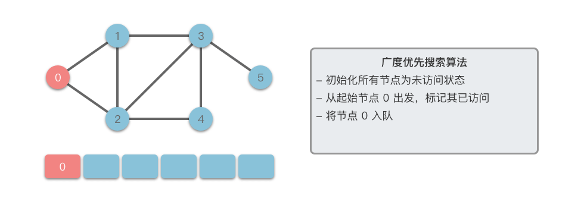
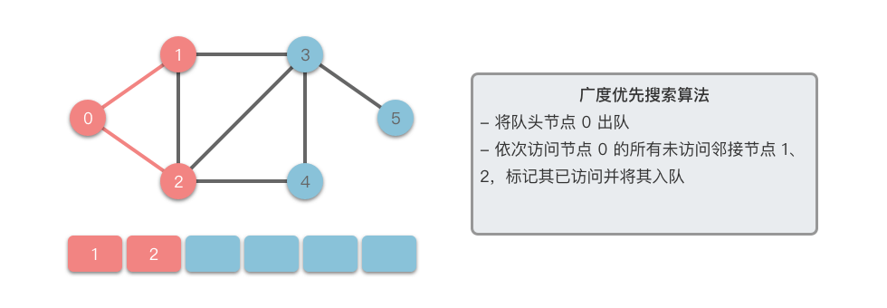
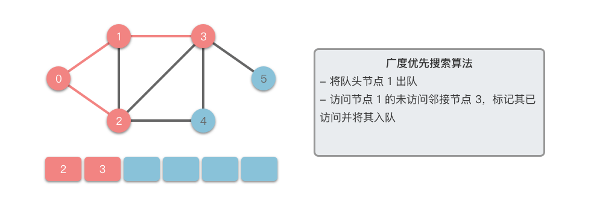
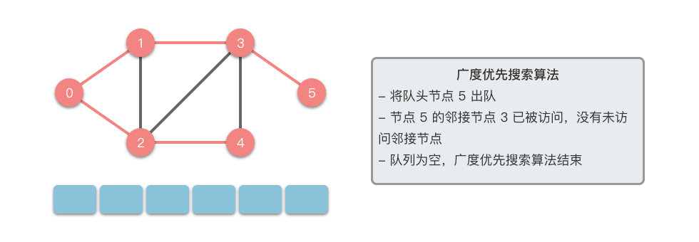

# 02.05.01 广度优先搜索（第 13 ~ 14 天）

## 1. 广度优先搜索简介

> **广度优先搜索算法（Breadth First Search）**：英文缩写为 BFS，又译作宽度优先搜索 / 横向优先搜索，是一种用于搜索树或图结构的算法。广度优先搜索算法从起始节点开始，逐层扩展，先访问离起始节点最近的节点，后访问离起始节点稍远的节点。以此类推，直到完成整个搜索过程。

因为遍历到的节点顺序符合「先进先出」的特点，所以广度优先搜索可以通过「队列」来实现。

## 2. 广度优先搜索算法步骤

接下来我们以一个无向图为例，介绍一下广度优先搜索的算法步骤。

1. 将起始节点 $u$ 放入队列中，并标记为已访问。
2. 从队列中取出一个节点，访问它并将其所有的未访问邻接节点 $v$ 放入队列中。
3. 标记已访问的节点 $v$，以避免重复访问。
4. 重复步骤 $2 \sim 3$，直到队列为空或找到目标节点。

<!-- tabs:start --> 

#### **<1>**



#### **<2>**



#### **<3>**



#### **<4>**


#### **<5>**


#### **<6>**


#### **<7>**



<!-- tabs:end --> 

## 3. 基于队列实现的广度优先搜索

### 3.1 基于队列实现的广度优先搜索算法步骤

1. 定义 $graph$ 为存储无向图的嵌套数组变量，$visited$ 为标记访问节点的集合变量，$queue$ 为存放节点的队列，$u$ 为开始节点，定义 `def bfs(graph, u):` 为队列实现的广度优先搜索方法。
2. 首先将起始节点 $u$ 标记为已访问，并将其加入队列中，即 `visited.add(u)`，`queue.append(u)`。
3. 从队列中取出队头节点 $u$。访问节点 $u$，并对节点进行相关操作（看具体题目要求）。
4. 遍历节点 $u$ 的所有未访问邻接节点 $v$（节点 $v$ 不在 $visited$ 中）。
5. 将节点 $v$ 标记已访问，并加入队列中，即 `visited.add(v)`，`queue.append(v)`。
6. 重复步骤 $3 \sim 5$，直到队列 $queue$ 为空。

### 3.2 基于队列实现的广度优先搜索实现代码

```python
import collections

class Solution:
    def bfs(self, graph, u):
        visited = set()                     # 使用 visited 标记访问过的节点
        queue = collections.deque([])       # 使用 queue 存放临时节点
        
        visited.add(u)                      # 将起始节点 u 标记为已访问
        queue.append(u)                     # 将起始节点 u 加入队列中
        
        while queue:                        # 队列不为空
            u = queue.popleft()             # 取出队头节点 u
            print(u)                        # 访问节点 u
            for v in graph[u]:              # 遍历节点 u 的所有未访问邻接节点 v
                if v not in visited:        # 节点 v 未被访问
                    visited.add(v)          # 将节点 v 标记为已访问
                    queue.append(v)         # 将节点 v 加入队列中
                

graph = {
    "0": ["1", "2"],
    "1": ["0", "2", "3"],
    "2": ["0", "1", "3", "4"],
    "3": ["1", "2", "4", "5"],
    "4": ["2", "3"],
    "5": ["3", "6"],
    "6": []
}

# 基于队列实现的广度优先搜索
Solution().bfs(graph, "0")
```

## 4. 广度优先搜索应用

### 4.1 克隆图

#### 4.1.1 题目链接

- [133. 克隆图 - 力扣（LeetCode）](https://leetcode.cn/problems/clone-graph/)

#### 4.1.2 题目大意

**描述**：以每个节点的邻接列表形式（二维列表）给定一个无向连通图，其中 $adjList[i]$ 表示值为 $i + 1$ 的节点的邻接列表，$adjList[i][j]$ 表示值为 $i + 1$ 的节点与值为 $adjList[i][j]$ 的节点有一条边。

**要求**：返回该图的深拷贝。

**说明**：

- 节点数不超过 $100$。
- 每个节点值 $Node.val$ 都是唯一的，$1 \le Node.val \le 100$。
- 无向图是一个简单图，这意味着图中没有重复的边，也没有自环。
- 由于图是无向的，如果节点 $p$ 是节点 $q$ 的邻居，那么节点 $q$ 也必须是节点 $p$ 的邻居。
- 图是连通图，你可以从给定节点访问到所有节点。

**示例**：

- 示例 1：


```python
输入：adjList = [[2,4],[1,3],[2,4],[1,3]]
输出：[[2,4],[1,3],[2,4],[1,3]]
解释：
图中有 4 个节点。
节点 1 的值是 1，它有两个邻居：节点 2 和 4 。
节点 2 的值是 2，它有两个邻居：节点 1 和 3 。
节点 3 的值是 3，它有两个邻居：节点 2 和 4 。
节点 4 的值是 4，它有两个邻居：节点 1 和 3 。
```

- 示例 2：


```python
输入：adjList = [[2],[1]]
输出：[[2],[1]]
```

#### 4.1.3 解题思路

##### 思路 1：广度优先搜索

1. 使用哈希表 $visited$ 来存储原图中被访问过的节点和克隆图中对应节点，键值对为「原图被访问过的节点：克隆图中对应节点」。使用队列 $queue$ 存放节点。
2. 根据起始节点 $node$，创建一个新的节点，并将其添加到哈希表 $visited$ 中，即 `visited[node] = Node(node.val, [])`。然后将起始节点放入队列中，即 `queue.append(node)`。
3. 从队列中取出第一个节点 $node\underline{}u$。访问节点 $node\underline{}u$。
4. 遍历节点 $node\underline{}u$ 的所有未访问邻接节点 $node\underline{}v$（节点 $node\underline{}v$ 不在 $visited$ 中）。
5. 根据节点 $node\underline{}v$ 创建一个新的节点，并将其添加到哈希表 $visited$ 中，即 `visited[node_v] = Node(node_v.val, [])`。
6. 然后将节点 $node\underline{}v$ 放入队列 $queue$ 中，即 `queue.append(node_v)`。
7. 重复步骤 $3 \sim 6$，直到队列 $queue$ 为空。
8. 广度优先搜索结束，返回起始节点的克隆节点（即 $visited[node]$）。

##### 思路 1：代码

```python
class Solution:
    def cloneGraph(self, node: 'Node') -> 'Node':
        if not node:
            return node
        
        visited = dict()
        queue = collections.deque()

        visited[node] = Node(node.val, [])
        queue.append(node)

        while queue:
            node_u = queue.popleft()
            for node_v in node_u.neighbors:
                if node_v not in visited:
                    visited[node_v] = Node(node_v.val, [])
                    queue.append(node_v)
                visited[node_u].neighbors.append(visited[node_v])
        
        return visited[node]
```

##### 思路 1：复杂度分析

- **时间复杂度**：$O(n)$。其中 $n$ 为图中节点数量。
- **空间复杂度**：$O(n)$。

### 4.2 岛屿的最大面积

#### 4.2.1 题目链接

- [695. 岛屿的最大面积 - 力扣（LeetCode）](https://leetcode.cn/problems/max-area-of-island/)

#### 4.2.2 题目大意

**描述**：给定一个只包含 $0$、$1$ 元素的二维数组，$1$ 代表岛屿，$0$ 代表水。一座岛的面积就是上下左右相邻的 $1$ 所组成的连通块的数目。

**要求**：计算出最大的岛屿面积。

**说明**：

- $m == grid.length$。
- $n == grid[i].length$。
- $1 \le m, n \le 50$。
- $grid[i][j]$ 为 $0$ 或 $1$。

**示例**：

- 示例 1：


```python
输入：grid = [[0,0,1,0,0,0,0,1,0,0,0,0,0],[0,0,0,0,0,0,0,1,1,1,0,0,0],[0,1,1,0,1,0,0,0,0,0,0,0,0],[0,1,0,0,1,1,0,0,1,0,1,0,0],[0,1,0,0,1,1,0,0,1,1,1,0,0],[0,0,0,0,0,0,0,0,0,0,1,0,0],[0,0,0,0,0,0,0,1,1,1,0,0,0],[0,0,0,0,0,0,0,1,1,0,0,0,0]]
输出：6
解释：答案不应该是 11 ，因为岛屿只能包含水平或垂直这四个方向上的 1 。
```

- 示例 2：

```python
输入：grid = [[0,0,0,0,0,0,0,0]]
输出：0
```

#### 4.2.3 解题思路

##### 思路 1：广度优先搜索

1. 使用 $ans$ 记录最大岛屿面积。
2. 遍历二维数组的每一个元素，对于每个值为 $1$ 的元素：
   1. 将该元素置为 $0$。并使用队列  $queue$ 存储该节点位置。使用 $temp\underline{}ans$ 记录当前岛屿面积。
   2. 然后从队列 $queue$ 中取出第一个节点位置 $(i, j)$。遍历该节点位置上、下、左、右四个方向上的相邻节点。并将其置为 $0$（避免重复搜索）。并将其加入到队列中。并累加当前岛屿面积，即 `temp_ans += 1`。
   3. 不断重复上一步骤，直到队列 $queue$ 为空。
   4. 更新当前最大岛屿面积，即 `ans = max(ans, temp_ans)`。
3. 将 $ans$ 作为答案返回。

##### 思路 1：代码

```python
import collections

class Solution:
    def maxAreaOfIsland(self, grid: List[List[int]]) -> int:
        directs = [(0, 1), (0, -1), (1, 0), (-1, 0)]
        rows, cols = len(grid), len(grid[0])
        ans = 0
        for i in range(rows):
            for j in range(cols):
                if grid[i][j] == 1:
                    grid[i][j] = 0
                    temp_ans = 1
                    queue = collections.deque([(i, j)])
                    while queue:
                        i, j = queue.popleft()
                        for direct in directs:
                            new_i = i + direct[0]
                            new_j = j + direct[1]
                            if new_i < 0 or new_i >= rows or new_j < 0 or new_j >= cols or grid[new_i][new_j] == 0:
                                continue
                            grid[new_i][new_j] = 0
                            queue.append((new_i, new_j))
                            temp_ans += 1

                    ans = max(ans, temp_ans)
        return ans
```

##### 思路 1：复杂度分析

- **时间复杂度**：$O(n \times m)$，其中 $m$ 和 $n$ 分别为行数和列数。
- **空间复杂度**：$O(n \times m)$。

## 参考资料

- 【文章】[广度优先搜索 - LeetBook - 力扣（LeetCode）](https://leetcode.cn/leetbook/read/bfs/e69rh1/)