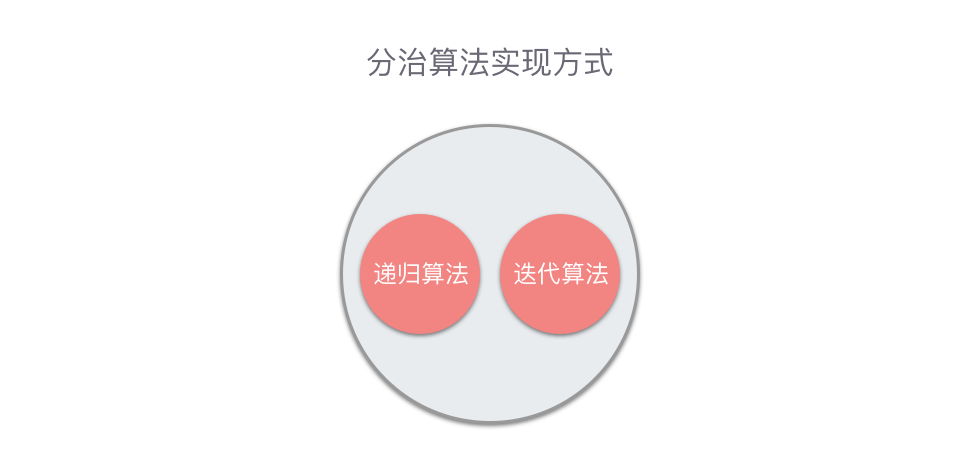

# 04.02.05 分治算法（第 05 ~ 06 天）

## 1. 分治算法简介

### 1.1 分治算法的定义

> **分治算法（Divide and Conquer）**：字面上的解释是「分而治之」，就是把一个复杂的问题分成两个或更多的相同或相似的子问题，直到最后子问题可以简单的直接求解，原问题的解即子问题的解的合并。

简单来说，分治算法的基本思想就是： **把规模大的问题不断分解为子问题，使得问题规模减小到可以直接求解为止。**


### 1.2 分治算法和递归算法的异同

从定义上来看，分治算法的思想和递归算法的思想是一样的，都是把规模大的问题不断分解为子问题。

其实，分治算法和递归算法的关系是包含与被包含的关系，可以看做： **递归算法 ∈ 分治算法**。

分治算法从实现方式上来划分，可以分为两种：「递归算法」和「迭代算法」。



一般情况下，分治算法比较适合使用递归算法来实现。但除了递归算法之外，分治算法还可以通过迭代算法来实现。比较常见的例子有：快速傅里叶变换算法、二分查找算法、非递归实现的归并排序算法等等。

我们先来讲解一下分支算法的适用条件，再来讲解一下基本步骤。

### 1.3 分治算法的适用条件

分治算法能够解决的问题，一般需要满足以下 $4$ 个条件：

1. **可分解**：原问题可以分解为若干个规模较小的相同子问题。
2. **子问题可独立求解**：分解出来的子问题可以独立求解，即子问题之间不包含公共的子子问题。
3. **具有分解的终止条件**：当问题的规模足够小时，能够用较简单的方法解决。 
4. **可合并**：子问题的解可以合并为原问题的解，并且合并操作的复杂度不能太高，否则就无法起到减少算法总体复杂度的效果了。

## 2. 分治算法的基本步骤

使用分治算法解决问题主要分为 $3$ 个步骤：

1. **分解**：把要解决的问题分解为成若干个规模较小、相对独立、与原问题形式相同的子问题。
2. **求解**：递归求解各个子问题。
3. **合并**：按照原问题的要求，将子问题的解逐层合并构成原问题的解。

其中第 $1$ 步中将问题分解为若干个子问题时，最好使子问题的规模大致相同。换句话说，将一个问题分成大小相等的 $k$ 个子问题的处理方法是行之有效的。在许多问题中，可以取 $k = 2$。这种使子问题规模大致相等的做法是出自一种平衡子问题的思想，它几乎总是比子问题规模不等的做法要好。

其中第 $2$ 步的「递归求解各个子问题」指的是按照同样的分治策略进行求解，即通过将这些子问题分解为更小的子子问题来进行求解。就这样一直分解下去，直到分解出来的子问题简单到只用常数操作时间即可解决为止。 

在完成第 $2$ 步之后，最小子问题的解可用常数时间求得。然后我们再按照递归算法中回归过程的顺序，由底至上地将子问题的解合并起来，逐级上推就构成了原问题的解。

按照分而治之的策略，在编写分治算法的代码时，也是按照上面的 $3$ 个步骤来编写的，其对应的伪代码如下：

```python
def divide_and_conquer(problems_n):             # problems_n 为问题规模
    if problems_n < d:                          # 当问题规模足够小时，直接解决该问题
        return solove()                         # 直接求解
    
    problems_k = divide(problems_n)             # 将问题分解为 k 个相同形式的子问题
    
    res = [0 for _ in range(k)]                 # res 用来保存 k 个子问题的解
    for problem_k in problems_k:
        res[i] = divide_and_conquer(problem_k)  # 递归的求解 k 个子问题
    
    ans = merge(res)                            # 合并 k 个子问题的解
    return ans                                  # 返回原问题的解
```

## 3. 分治算法的复杂度分析

 分治算法中，在不断递归后，最后的子问题将变得极为简单，可在常数操作时间内予以解决，其带来的时间复杂度在整个分治算法中的比重微乎其微，可以忽略不计。所以，分治算法的时间复杂度实际上是由「分解」和「合并」两个部分构成的。

一般来讲，分治算法将一个问题划分为 $a$ 个形式相同的子问题，每个子问题的规模为 $n/b$，则总的时间复杂度的递归表达式可以表示为：

$T(n) = \begin{cases} \begin{array} \ \Theta{(1)} & n = 1 \cr a \times T(n/b) + f(n) & n > 1 \end{array} \end{cases}$

其中，每次分解时产生的子问题个数是 $a$ ，每个子问题的规模是原问题规模的 $1 / b$，分解和合并 $a$ 个子问题的时间复杂度是 $f(n)$。

这样，求解一个分治算法的时间复杂度，就是求解上述递归表达式。关于递归表达式的求解有多种方法，这里我们介绍一下比较常用的「递推求解法」和「递归树法」。

### 3.1 递推求解法

根据问题的递归表达式，通过一步步递推分解推导，从而得到最终结果。

以「归并排序算法」为例，接下来我们通过递推求解法计算一下归并排序算法的时间复杂度。

我们得出归并排序算法的递归表达式如下：

$T(n) = \begin{cases} \begin{array} \ O{(1)} & n = 1 \cr 2 \times T(n/2) + O(n) & n > 1 \end{array} \end{cases}$

根据归并排序的递归表达式，当 $n > 1$ 时，可以递推求解：

$\begin{align} T(n) & =   2 \times T(n/2) + O(n) \cr & = 2 \times (2 \times T(n / 4) + O(n/2)) + O(n) \cr & = 4 \times T(n/4) + 2 \times O(n) \cr & = 8 \times T(n/8) + 3 \times O(n) \cr & = …… \cr & = 2^x \times T(n/2^x) + x \times O(n) \end{align}$

递推最终规模为 $1$，令 $n = 2^x$，则 $x = \log_2n$，则：

$\begin{align} T(n) & = n \times T(1) + \log_2n \times O(n) \cr & = n + \log_2n \times O(n) \cr & = O(n \times \log_2n) \end{align}$

则归并排序的时间复杂度为 $O(n \times \log_2n)$。

### 3.2 递归树法

递归树求解方式其实和递推求解一样，只不过递归树能够更清楚直观的显示出来，更能够形象地表达每层分解的节点和每层产生的时间成本。

使用递归树法计算时间复杂度的公式为：

$\text{时间复杂度} = \text{叶子数} \times T(1) + \text{成本和} = 2^x \times T(1) + x \times O(n)$。

我们还是以「归并排序算法」为例，通过递归树法计算一下归并排序算法的时间复杂度。

归并排序算法的递归表达式如下：

$T(n) = \begin{cases} \begin{array} \ O{(1)} & n = 1 \cr 2T(n/2) + O(n) & n > 1 \end{array} \end{cases}$

其对应的递归树如下图所示。


因为 $n = 2^x$，则 $x = \log_2n$，则归并排序算法的时间复杂度为：$2^x \times T(1) + x \times O(n) = n + \log_2n \times O(n) = O(n \times log_2n)$。

## 4. 分治算法的应用

### 4.1 归并排序

#### 4.1.1 题目链接

- [912. 排序数组 - 力扣（LeetCode） ](https://leetcode.cn/problems/sort-an-array/)

#### 4.1.2 题目大意

**描述**：给定一个整数数组 $nums$。

**要求**：对该数组升序排列。

**说明**：

- $1 \le nums.length \le 5 * 10^4$。
- $-5 * 10^4 \le nums[i] \le 5 * 10^4$。

**示例**：

```python
输入    nums = [5,2,3,1]
输出    [1,2,3,5]
```

#### 4.1.3 解题思路

我们使用归并排序算法来解决这道题。

1. **分解**：将待排序序列中的 $n$ 个元素分解为左右两个各包含 $\frac{n}{2}$ 个元素的子序列。
2. **求解**：递归将子序列进行分解和排序，直到所有子序列长度为 $1$。
3. **合并**：把当前序列组中有序子序列逐层向上，进行两两合并。

使用归并排序算法对数组排序的过程如下图所示。


#### 4.1.4 代码

```python
class Solution:
    def merge(self, left_arr, right_arr):           # 合并
        arr = []
        while left_arr and right_arr:               # 将两个排序数组中较小元素依次插入到结果数组中
            if left_arr[0] <= right_arr[0]:
                arr.append(left_arr.pop(0))
            else:
                arr.append(right_arr.pop(0))
                
        while left_arr:                             # 如果左子序列有剩余元素，则将其插入到结果数组中
            arr.append(left_arr.pop(0))
        while right_arr:                            # 如果右子序列有剩余元素，则将其插入到结果数组中
            arr.append(right_arr.pop(0))
        return arr                                  # 返回排好序的结果数组

    def mergeSort(self, arr):                       # 分解
        if len(arr) <= 1:                           # 数组元素个数小于等于 1 时，直接返回原数组
            return arr
        
        mid = len(arr) // 2                         # 将数组从中间位置分为左右两个数组。
        left_arr = self.mergeSort(arr[0: mid])      # 递归将左子序列进行分解和排序
        right_arr =  self.mergeSort(arr[mid:])      # 递归将右子序列进行分解和排序
        return self.merge(left_arr, right_arr)      # 把当前序列组中有序子序列逐层向上，进行两两合并。

    def sortArray(self, nums: List[int]) -> List[int]:
        return self.mergeSort(nums)
```

### 4.2 二分查找

#### 4.2.1 题目链接

- [704. 二分查找 - 力扣（LeetCode）](https://leetcode.cn/problems/binary-search/)

#### 4.2.2 题目大意

**描述**：给定一个含有 $n$ 个元素有序的（升序）整型数组 $nums$ 和一个目标值 $target$。

**要求**：返回 $target$ 在数组 $nums$ 中的位置，如果找不到，则返回 $-1$。

**说明**：

- 假设 $nums$ 中的所有元素是不重复的。
- $n$ 将在 $[1, 10000]$ 之间。
- $-9999 \le nums[i] \le 9999$。

**示例**：

```python
输入    nums = [-1,0,3,5,9,12], target = 9
输出    4
解释    9 出现在 nums 中并且下标为 4
```

#### 4.2.3 解题思路

我们使用分治算法来解决这道题。与其他分治题目不一样的地方是二分查找不用进行合并过程，最小子问题的解就是原问题的解。

1. **分解**：将数组的 $n$ 个元素分解为左右两个各包含 $\frac{n}{2}$ 个元素的子序列。
2. **求解**：取中间元素 $nums[mid]$ 与 $target$ 相比。
   1. 如果相等，则找到该元素；
   2. 如果 $nums[mid] < target$，则递归在左子序列中进行二分查找。
   3. 如果 $nums[mid] > target$，则递归在右子序列中进行二分查找。

二分查找的的分治算法过程如下图所示。


#### 4.2.4 代码

二分查找问题的非递归实现的分治算法代码如下：

```python
class Solution:
    def search(self, nums: List[int], target: int) -> int:
        left = 0
        right = len(nums) - 1
        # 在区间 [left, right] 内查找 target
        while left < right:
            # 取区间中间节点
            mid = left + (right - left) // 2
            # nums[mid] 小于目标值，排除掉不可能区间 [left, mid]，在 [mid + 1, right] 中继续搜索
            if nums[mid] < target:
                left = mid + 1 
            # nums[mid] 大于等于目标值，目标元素可能在 [left, mid] 中，在 [left, mid] 中继续搜索
            else:
                right = mid
        # 判断区间剩余元素是否为目标元素，不是则返回 -1
        return left if nums[left] == target else -1
```

## 参考资料

- 【书籍】趣学算法 - 陈小玉 著
- 【书籍】算法之道 - 邹恒铭 著
- 【书籍】算法图解 - 袁国忠 译
- 【书籍】算法训练营 陈小玉 著
- 【博文】[从合并排序算法看“分治法” - 船长&CAP - 博客园](https://www.cnblogs.com/liuning8023/archive/2012/06/25/2562747.html)
- 【博文】[递归、迭代、分治、回溯、动态规划、贪心算法 - 力扣](https://leetcode.cn/circle/article/yXFal5/)
- 【博文】[递归 & 分治 - OI Wiki](https://oi-wiki.org/basic/divide-and-conquer/)
- 【博文】[漫画：5分钟弄懂分治算法！它和递归算法的关系！](https://mp.weixin.qq.com/s/0Z1tiqWTO410jYTJ4K0Ihg)